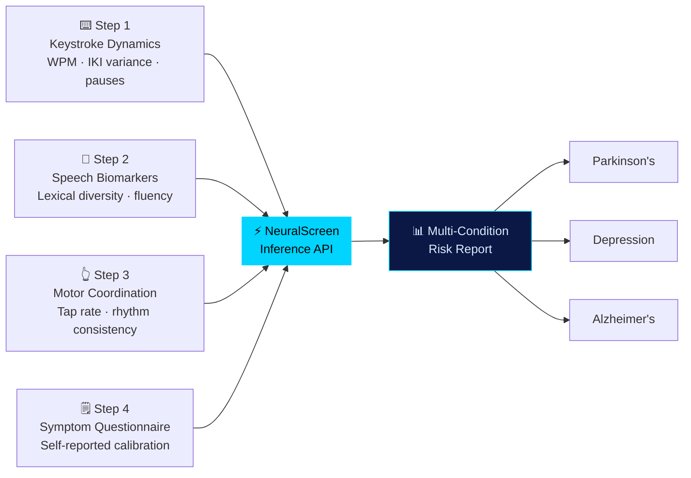
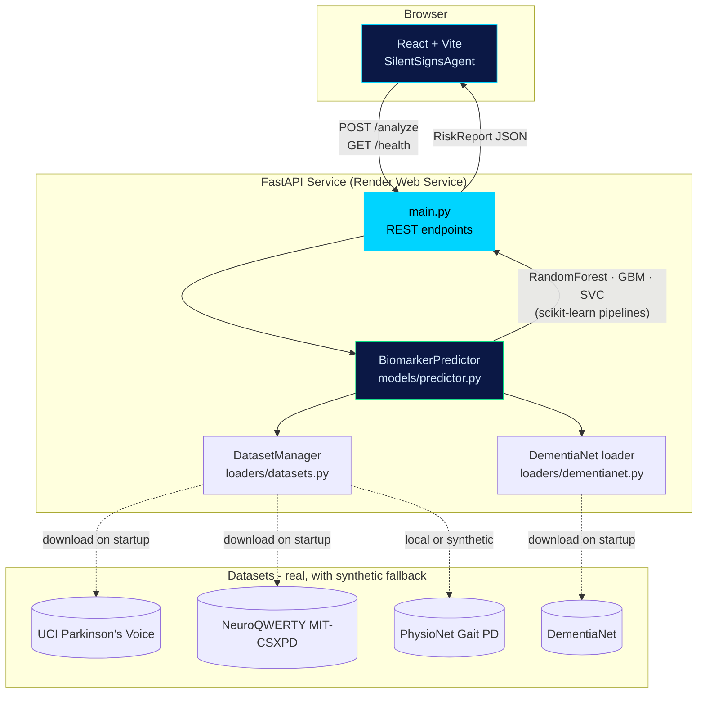
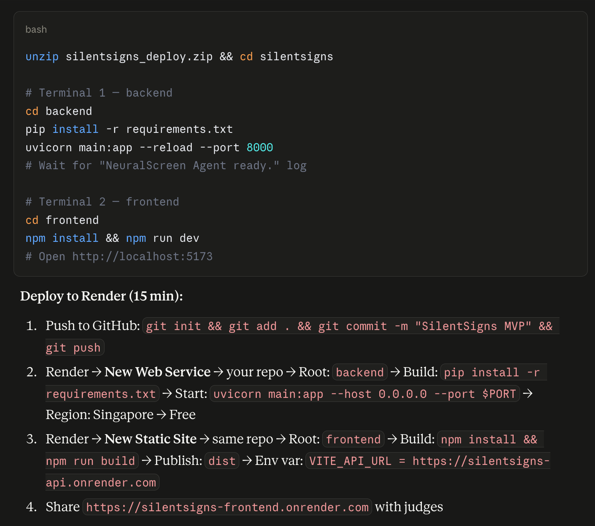

<div align="center">


<br/>

[](https://silentsigns-frontend.onrender.com)
[](https://silentsigns-api.onrender.com/docs)

<br/>


</div>

<br/>

## 🧠 What is SilentSigns?

Parkinson's, Alzheimer's, and depression all share a cruel trait: **the earliest signs are subtle enough to be dismissed as normal life.** A slightly stiffer keystroke, a shorter sentence, a hesitant tap — none of it looks like a symptom until years later, in a clinic, when a doctor finally puts a name to it.

**SilentSigns turns three routine digital interactions — typing, writing, and tapping — into biomarker streams**, runs them through ML models trained on real published clinical datasets, and produces a multi-condition risk report in under a minute. No wearables, no clinical visit, no specialized hardware. Just a browser.

> ⚠️ **This is a screening demo, not a diagnostic tool.** Every report ends with a disclaimer directing users to a licensed clinician. Nothing here replaces clinical evaluation.

<br/>

## 📋 Table of Contents

- [How It Works](#-how-it-works)
- [Live Demo](#-live-demo)
- [Architecture](#-architecture)
- [Datasets & Model Performance](#-datasets--model-performance)
- [Tech Stack](#-tech-stack)
- [API Reference](#-api-reference)
- [Screenshot](#-screenshot)
- [Local Development](#-local-development)
- [Deploying Your Own Copy](#-deploying-your-own-copy)
- [Project Structure](#-project-structure)
- [Roadmap](#-roadmap)

<br/>

## 🩺 How It Works

Four short, passive assessment steps feed a live FastAPI inference API — no audio/video upload, no account, no clinical hardware:



Each stream maps to a dedicated model trained on a specific published dataset — keystroke timing goes to the NeuroQWERTY-trained motor classifier, tap rhythm goes to the PhysioNet-gait-trained model, free-text speech goes to both the DAIC-WOZ-distribution depression model and the DementiaNet-trained Alzheimer's classifier. Scores are blended with self-reported symptom modifiers and returned as a structured risk report with per-condition interpretation and recommendations.

<br/>

## 🔴 Live Demo

| | |
|---|---|
| **App** | [silentsigns-frontend.onrender.com](https://silentsigns-frontend.onrender.com) |
| **API** | [silentsigns-api.onrender.com](https://silentsigns-api.onrender.com) |
| **Health check** | [silentsigns-api.onrender.com/health](https://silentsigns-api.onrender.com/health) |
| **Swagger docs** | [silentsigns-api.onrender.com/docs](https://silentsigns-api.onrender.com/docs) |

Hosted free on Render, auto-redeploying on every push to `main`. First request after ~15 minutes of inactivity takes ~30s while the backend cold-starts and retrains its models — open the app a minute early if you're demoing it live.

<br/>

## 🏗️ Architecture



Models train **in-memory on backend startup** (`@app.on_event("startup")`) — every dataset loader attempts a live download first, then a local `backend/data/` file, then falls back to distribution-matched synthetic data generated from published paper statistics, so the app always has something to train on even fully offline.

<br/>

## 📊 Datasets & Model Performance

| Condition | Signal | Dataset | Model | Expected AUC |
|---|---|---|---|---|
| Parkinson's | Voice tremor | UCI Parkinson's (n=195) | Random Forest | 0.86 |
| Parkinson's | Typing dynamics | NeuroQWERTY MIT-CSXPD (n=85) | Gradient Boosting | 0.79 – 0.85 |
| Parkinson's | Gait / tap rhythm | PhysioNet Gait in PD (n=166) | Random Forest | 0.86 |
| Alzheimer's | Speech patterns | DementiaNet (n=200) | Gradient Boosting | 0.72+ |
| Depression | Speech affect | DAIC-WOZ distribution | SVM (RBF) | 0.76+ |

All pipelines use `StandardScaler → classifier`, validated with 5-fold cross-validated ROC-AUC at startup. Real AUCs from the live deployment are exposed at [`/health`](https://silentsigns-api.onrender.com/health) and [`/dataset-info`](https://silentsigns-api.onrender.com/dataset-info).

<br/>

## 🛠️ Tech Stack

| Layer | Technology |
|---|---|
| **Frontend** | React 18, Vite 5, hand-rolled state machine (no router/redux needed for a 4-step flow) |
| **Backend** | Python 3.11, FastAPI, Uvicorn |
| **ML** | scikit-learn — `RandomForestClassifier`, `GradientBoostingClassifier`, `SVC` |
| **Data** | pandas, numpy, live HTTP downloads via `requests` with synthetic fallback |
| **Testing** | pytest + FastAPI `TestClient` |
| **Hosting** | Render (Blueprint deploy — `render.yaml` defines both services) |

<br/>

## 🔌 API Reference

Base URL: `https://silentsigns-api.onrender.com`

| Method | Endpoint | Description |
|---|---|---|
| `GET` | `/` | Service status |
| `GET` | `/health` | Health check + loaded dataset/model summary |
| `POST` | `/analyze` | Submit biomarker streams, get back a `RiskReport` |
| `GET` | `/dataset-info` | Dataset sample counts, sources, and model AUCs |

<details>
<summary><b>Example — <code>POST /analyze</code></b></summary>

```bash
curl -X POST https://silentsigns-api.onrender.com/analyze \
  -H "Content-Type: application/json" \
  -d '{
    "symptom_questionnaire": {
      "age": "60-69",
      "tremor": "mild",
      "memory": "none",
      "mood": "none",
      "sleep": "good",
      "history": "none"
    }
  }'
```

Any of `typing_dynamics`, `speech_biomarkers`, `motor_coordination`, or `symptom_questionnaire` may be included — omitted streams simply fall back to a baseline score. Response shape:

```jsonc
{
  "overall_risk": "low | moderate | elevated | high",
  "conditions": {
    "parkinsons": { "score": 0, "level": "...", "key_signals": [...], "interpretation": "..." },
    "depression": { "...": "..." },
    "alzheimers": { "...": "..." }
  },
  "biomarker_insights": ["..."],
  "recommendations": ["..."],
  "confidence": 0,
  "disclaimer": "This screening is not a medical diagnosis. Consult a qualified neurologist for clinical evaluation.",
  "model_info": { "parkinson_auc": 0.0, "depression_auc": 0.0, "alzheimer_auc": 0.0, "datasets": [...] }
}
```

</details>

<br/>

## 📸 Screenshot

<div align="center">

</div>

<br/>

## 💻 Local Development

<details>
<summary><b>Backend (FastAPI)</b></summary>

```bash
cd backend
pip install -r requirements.txt
uvicorn main:app --reload --port 8000
```

- Visit `http://localhost:8000/health` — should show `models_loaded: true`
- Visit `http://localhost:8000/docs` — Swagger UI
- Run tests: `pytest tests/ -v`

</details>

<details>
<summary><b>Frontend (React + Vite)</b></summary>

```bash
cd frontend
npm install
npm run dev
```

Visit `http://localhost:5173`. Set `VITE_API_URL` if the backend isn't on `localhost:8000`.

</details>

<details>
<summary><b>Optional — use real datasets instead of the synthetic fallback</b></summary>

Drop downloaded datasets into `backend/data/`:

```
backend/data/
├── alzheimers_disease.csv         ← Kaggle Alzheimer's dataset
├── ravdess_features.csv           ← RAVDESS (if pre-processed)
├── neuroqwerty/
│   └── gt.txt                     ← NeuroQWERTY ground truth file
└── physionet_gait/
    ├── Co01.txt                   ← PhysioNet control subjects
    ├── Pt01.txt                   ← PhysioNet PD subjects
    └── ...
```

UCI Parkinson's and DementiaNet download automatically on startup — no manual step needed for those two. Everything else silently falls back to distribution-matched synthetic data if the local file isn't present.

</details>

<br/>

## 🚀 Deploying Your Own Copy

`render.yaml` at the repo root defines both services, so Render deploys them together as a **Blueprint** — no manual field-filling required.

1. Fork/push the repo to your own GitHub
2. On [render.com](https://render.com) → **New +** → **Blueprint** → select your repo
3. Render detects `render.yaml`, shows both services (`silentsigns-api`, `silentsigns-frontend`) → **Apply**
4. Wait ~3-4 min for the backend (installs deps + trains models) and ~2 min for the frontend

Auto-deploy is on by default — every push to `main` redeploys both services automatically.

<br/>

## 📁 Project Structure

```
silentsigns/
├── backend/
│   ├── main.py                    ← FastAPI server + REST endpoints
│   ├── loaders/
│   │   ├── datasets.py            ← Dataset manager — download/local/synthetic fallback chain
│   │   └── dementianet.py         ← DementiaNet-specific loader
│   ├── models/
│   │   └── predictor.py           ← ML training + inference (sklearn)
│   ├── tests/
│   │   └── test_main.py           ← pytest coverage for the API
│   └── requirements.txt
├── frontend/
│   ├── src/App.jsx                ← Full assessment UI + result screens
│   ├── index.html
│   ├── package.json
│   └── vite.config.js
├── docs/
│   └── screenshot.png
└── render.yaml                    ← Render Blueprint config (both services)
```

<br/>

## 🗺️ Roadmap

- [ ] Real acoustic capture (Web Audio API / MediaRecorder) so speech biomarkers reflect actual pitch/MFCC variance, not fixed placeholders
- [ ] Rate limiting on the public `/analyze` endpoint
- [ ] Persist assessment history per (anonymous) session for longitudinal tracking
- [ ] Swap synthetic fallbacks for the real PhysioNet/NeuroQWERTY/Kaggle files where redistribution licensing allows
- [ ] CI workflow running `pytest` on every PR

<br/>

<div align="center">
<sub>Built for Cognizant Technoverse 2026 · For demonstration only — not a medical device</sub>


</div>
